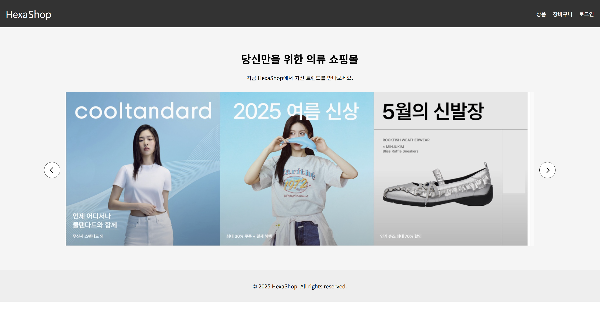
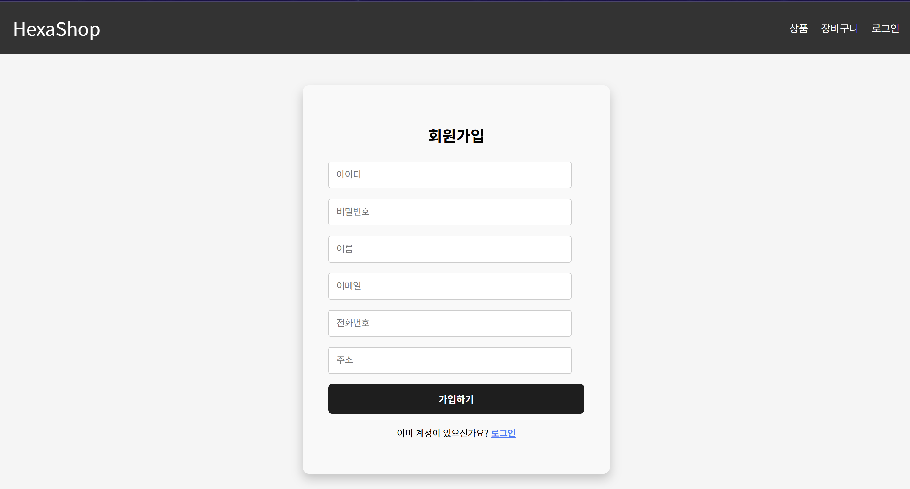
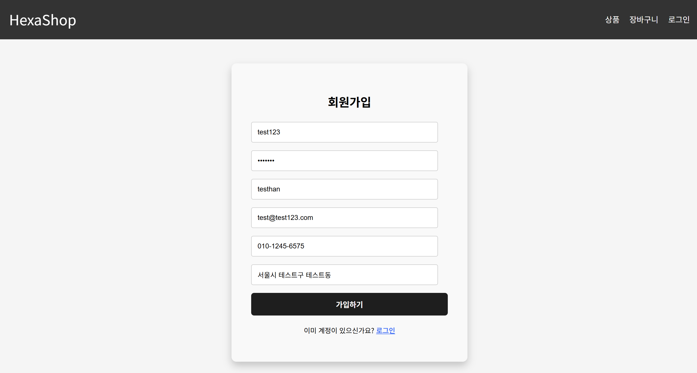
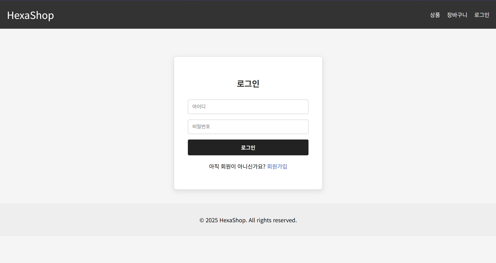
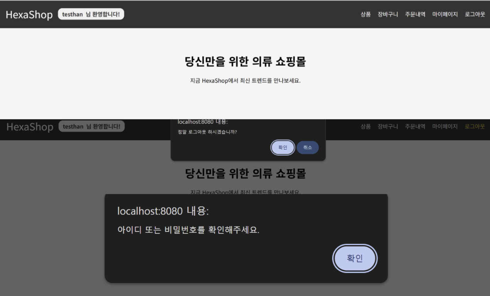
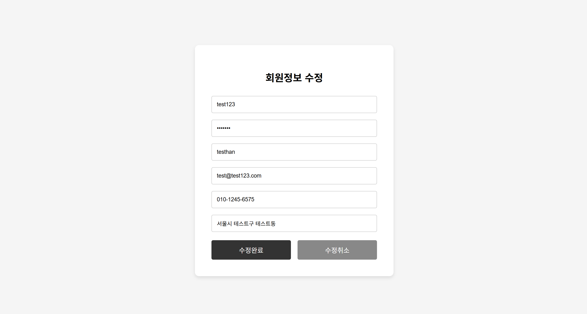

# Hexa Shopping Mall

Java 기반으로 구현한 의류 쇼핑몰 웹사이트 팀 프로젝트입니다.  
5인 팀으로 약 2주간 개발했으며, 회원가입, 로그인, 회원정보 수정 기능을 담당했습니다.

---

## 1. 프로젝트 개요

- **프로젝트명**: Hexa Shopping Mall
- **진행 형태**: 팀 프로젝트
- **개발 기간**: 2025.04.22 ~ 2025.05.06
- **참여 인원**: 5명
- **주제**: 의류 쇼핑몰 웹사이트
- **담당 기능**: 회원가입, 로그인, 회원정보 수정 기능 구현
- **원본 프로젝트명**: `web-project-team2-shoppingmall`
- **포트폴리오 저장소**: `hexa-shopping-mall`

Hexa Shopping Mall은 사용자가 의류 상품을 조회하고 쇼핑몰 서비스를 이용할 수 있도록 구현한 팀 프로젝트입니다.  
회원가입, 로그인, 회원정보 수정과 같은 사용자 기능을 포함하여 실제 쇼핑몰 서비스와 유사한 흐름을 구현하고자 했습니다.

이 프로젝트를 통해 사용자 기능 구현과 데이터 처리 흐름을 경험할 수 있었으며, GitHub를 활용한 협업 방식도 함께 익힐 수 있었습니다.  
또한 기능별로 역할을 나누어 개발하면서 웹 애플리케이션의 기본 구조를 이해하고, 팀 단위 개발의 흐름을 경험할 수 있었습니다.

---

## 2. 담당 역할

프로젝트에서 아래 회원 기능 구현에 참여했습니다.

- **회원가입**
  - 회원가입 입력 폼 구현
  - 사용자 정보 입력 및 데이터 저장 처리

- **로그인**
  - 아이디 / 비밀번호 인증 처리
  - 로그인 성공 및 실패 흐름 구현
  - 오류 메시지 출력 처리

- **회원정보 수정**
  - 회원정보 조회 및 수정 기능 구현
  - 이름, 비밀번호, 전화번호, 주소, 이메일 수정 처리
  - 아이디는 수정 불가, 화면에 표시만 되도록 구현

회원 기능을 담당하면서 사용자 입력부터 데이터베이스 반영, 결과 출력으로 이어지는 웹 서비스의 기본 구조를 경험할 수 있었습니다.

---

## 3. 기술 스택

### Backend
- Java
- JSP
- Servlet
- MyBatis

### Database
- Oracle DB
- SQL

### Frontend
- HTML
- CSS

### Tools
- Gradle
- GitHub

---

## 4. 주요 기능

### 1) Main Page
메인 페이지는 사용자가 쇼핑몰에 처음 접속했을 때 보게 되는 화면으로,  
서비스의 전체 분위기와 기본 이동 흐름을 보여주도록 구성했습니다.

상단 메뉴를 통해 상품, 장바구니, 로그인 기능으로 이동할 수 있도록 했고,  
중앙 배너 영역을 활용해 의류 쇼핑몰의 메인 이미지를 강조했습니다.

### 2) Sign Up
회원가입 기능은 사용자가 쇼핑몰 서비스를 이용하기 위해 필요한 기본 기능으로,  
아이디, 비밀번호, 이름, 이메일, 전화번호, 주소 등의 정보를 입력받아 회원 데이터로 저장할 수 있도록 구현했습니다.

사용자가 입력한 값이 정상적으로 전달되고 저장될 수 있도록  
회원가입 폼과 데이터 처리 흐름을 확인하며 기능을 구현했습니다.

### 3) Login
로그인 기능은 사용자가 입력한 아이디와 비밀번호를 확인하여  
정상적으로 서비스를 이용할 수 있도록 하는 기능입니다.

입력한 회원 정보를 서버에서 확인하고, 로그인 성공 시 사용자 인증이 이루어지도록 구현했습니다.  
또한 잘못된 정보를 입력한 경우 오류 메시지를 출력하여  
사용자가 입력값을 다시 확인할 수 있도록 처리했습니다.

### 4) Edit Profile
회원정보 수정 기능은 로그인한 사용자가 자신의 정보를 확인하고 변경할 수 있도록 구현했습니다.  
기존 회원 정보를 조회한 뒤, 수정한 내용을 다시 저장하여 변경 사항이 반영되도록 구성했습니다.

이 과정에서 이름, 비밀번호, 전화번호, 주소, 이메일과 같은 정보를 수정할 수 있도록 처리했고,  
아이디는 회원 식별 정보이기 때문에 수정 없이 표시만 되도록 구현했습니다.

---

## 5. 주요 화면

### Main Page

### Sign Up

### Sign Up Example

### Login

### Login Example

### Edit Profile

---

## 6. Trouble Shooting

### GitHub 병합 과정에서 발생한 문제

팀 프로젝트를 진행하며 GitHub를 통해 각자 작업한 내용을 병합하는 과정에서,  
기존에 작성한 코드가 예상과 다르게 동작하는 상황이 있었습니다.

여러 사람이 동시에 작업을 진행하다 보니 같은 파일이나 연결된 기능의 변경 내용이 겹치면서,  
병합 이후 일부 코드 흐름이 어긋난 문제가 발생했습니다.

이를 해결하기 위해 변경된 파일의 내용을 다시 비교하고,  
팀원들과 수정한 부분을 확인하며 필요한 코드를 정리하는 방식으로 문제를 해결했습니다.  
이후에는 작업 범위를 더 명확하게 나누고, 변경 사항을 먼저 공유한 뒤 병합을 진행하는 방향으로 협업 방식을 조정했습니다.

이 경험을 통해 팀 프로젝트에서는 기능 구현뿐 아니라,  
버전 관리와 변경 사항 공유 역시 프로젝트 완성도에 큰 영향을 준다는 점을 배울 수 있었습니다.

---

## 7. 배운 점

이 프로젝트를 통해 회원 기능 구현 과정을 직접 경험하면서  
사용자 입력, 데이터 처리, 결과 출력으로 이어지는 웹 애플리케이션의 흐름을 이해할 수 있었습니다.

또한 GitHub를 활용한 협업 과정에서  
단순히 기능을 구현하는 것뿐 아니라,  
팀원들과의 작업 조율과 변경 사항 공유도 매우 중요하다는 점을 배울 수 있었습니다.

앞으로는 사용자 입장에서 더 편리한 기능을 고민하고,  
안정적으로 동작하는 웹 서비스를 구현할 수 있는 개발자로 성장하고자 합니다.

---

## 8. 참고 사항

- 본 저장소는 포트폴리오 정리를 위해 별도로 구성한 프로젝트 저장소입니다.
- 일부 예시 데이터 및 화면 구성은 포트폴리오 용도로 정리되었습니다.
- 민감할 수 있는 정보는 예시값 또는 비식별 형태로 정리하여 사용했습니다.

---

## 9. 작성자

- **이름**: 한우태
- **희망 분야**: Java 백엔드 개발
